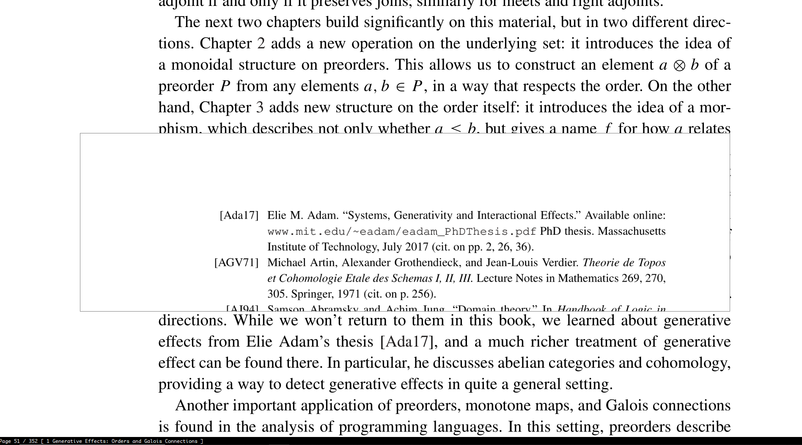
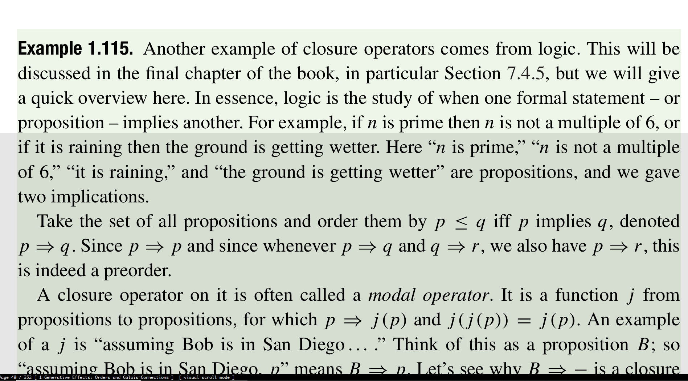
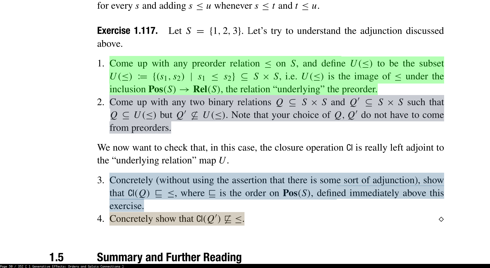
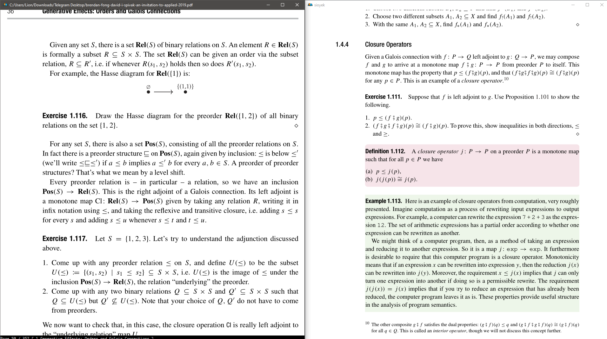

Usage
============

Note that all the keybindings in this section are the default keybindings that can be changed by editing :code:`keys_user.config`.
Each key executes a command. In order to add a keybinding that executes a command, you add the following to :code:`keys_user.config`:

.. code-block:: console

   command key

For example suppose you want to use the :code:`j` key to move down. You can add the following to your config file:

.. code-block:: console

   move_down j

Opening Files
^^^^^^^^^^^^^

- Press :code:`o` to open the select file menu. (:code:`open_document` command)
- Press :code:`<Shift o>` (:code:`O`) to open a searchable list of recently opened files. (:code:`open_prev_doc` command)
- Press :code:`<Ctrl o>` to open an embedded file system browser. (:code:`open_document_embedded` command)

Basic Movement
^^^^^^^^^^^^^^
- You can move the screen using the arrow keys. (corresponding to the following commands: :code:`move_down`, :code:`move_up`, :code:`move_left` and :code:`move_right`)
- You can also use the mouse wheel to scroll the screen.
- Press :code:`gg` to go to the first page and :code:`G` to go to the last page. (:code:`goto_begining` and :code:`goto_end` commands)
- In order to go to a specific page you can enter the page number and then press :code:`gg`. For example in order to go to page 42, you should enter :code:`42gg`.
- To go to a specific page, you can also press the :code:`HOME` button which opens a menu where you can enter the page number. (:code:`goto_page_with_page_number` command)
- You can prefix most commands with a number :code:`n` which usually means repeat that command :code:`n` times. For example pressing :code:`10<down arrow>` is equivalent to pressing down arrow 10 times.
- Press :code:`space` to move the screen down and :code:`<Shift space>` to move the screen up. (:code:`screen_down` and :code:`screen_up` commands)
- Press :code:`<Ctrl PageDown>`/:code:`<Ctrl PageUp>` to go to the next/previous page. (:code:`next_page` and :code:`previous_page` commands)
- Press :code:`t` to open a searchable table of contents. You can jump to table of content entries by selecting. (:code:`goto_toc`)
- Press :code:`gc` to go to the next chapter and :code:`gC` to go to the previous chapter. (:code:`next_chapter` and :code:`prev_chapter` commands)

Zoom
^^^^
- Press :code:`+` (:code:`<Shift =>`) to zoom in and :code:`-` to zoom out. (:code:`zoom_in` and :code:`zoom_out` commands)
- You can also use the mouse wheel while holding control to zoom in/out.
- Press :code:`f9` to fit the page to window width. (:code:`fit_to_page_width` command)
- Press :code:`f10` to fit the page to window width ignoring white page margins. (:code:`fit_to_page_width_smart` command)

History Navigation
^^^^^^^^^^^^^^^^^^
Sioyek keeps a full, browser-like history of your locations. For example suppose you click on a link in the PDF file to go to a figure.
You can now return back to the location of the link by issuing the :code:`prev_state` command. Now, you can again return to the figure by issuing :code:`next_state` command.
Note that this history even works across multiple documents. For example if I am viewing document :code:`A.pdf` and then open :code:`B.pdf` I can return back to :code:`A.pdf` by going back in history.

- You can go back/forward in history by pressing :code:`backspace`/:code:`<Shift backspace>` or :code:`Ctrl LeftArrow`/:code:`Ctrl RightArrow`. (:code:`prev_state` and :code:`next_state` commands)

.. _SmartJump:

Overview and SmartJump
^^^^^^^^^^^^^^^^^^^^^^

- You can right click on PDF links to open a quick overview of the link destination. You can navigate in this overview using mouse wheel.
- Even if the PDF document has no links, you can right click on items and sioyek tries to open an overview of item destination. For example right clicking on the text "Figure 2.19" opens an overview showing (hopefully) Figure 2.19 . This also works with equations, tables, references, etc.
- You can also middle click on items to directly jump to their location instead of opening an overview.

.. |bt| raw:: html

    <code class="code docutils literal notranslate">`</code>

.. |bta| raw:: html

    <code class="code docutils literal notranslate">`a</code>

Underline
^^^^^^^^^

If you right click on a line of text in a PDF file, sioyek displays a visual highlight below that line (we refer to this as the "visual mark" from now on). This visual mark has multiple use-cases.

1. It can act as a simple mark (see `Marks`_). You can always return to the last location of visual mark by pressing |bt| and then right-clicking. This can be useful when you want to quickly check previous pages and jump back to where you were.
2. It highlights the current line being read which reduces eye strain and prevents losing your place in PDF files.

- You can move the visual mark to the next/previous line by pressing :code:`j`/:code:`k` (:code:`move_visual_mark_down` and :code:`move_visual_mark_up` commands).
- You can toggle visual scroll mode by pressing :code:`f7`. In this mode, mouse wheel moves the visual mark up and down.

Search
^^^^^^

- Press :code:`/` or :code:`<Ctrl f>` to open the search menu. (:code:`search` command)
- Once a search is initiated, you can press :code:`n` to go to the next match or :code:`N` to go to the previous match. (:code:`next_item` and :code:`previous_item` commands)
- You can enter :code:`c/` to search only the current chapter. (:code:`chapter_search` command).
- You can limit the search range to specific page range using the following syntax in the search bar :code:`<begin,end>search term`. For example, if you want to search for the term 'Figure' in pages 20 to 30, you can enter the following::

   <20,30>Figure

.. _Marks:

Marks
^^^^^

Sometimes while reading a document, you need to glance at the contents of previous pages and quickly return to the original location. For example, maybe you forgot the definition of a
term that was defined a few pages ago, or perhaps the current paragraph is referencing a previous figure. Using marks, you can mark your location before glancing at previous content and then quickly return to the location of the mark.

- In order to create a mark, first press :code:`m` (:code:`set_mark` command) followed by an alphabet symbol (this symbol will be the name of the mark, you can have multiple marks with different names). For example, in order to create a mark named :code:`a` for your current location, enter :code:`ma`.
- You can go to a mark by  pressing |bt| followd by the name of the mark (note that |bt| is different from single quote :code:`'`. |bt| usually is on the same key as :code:`~`). For example, in order to go back to the mark created in the previous example, enter |bta|. (:code:`goto_mark` command)
- Marks are persistent (they are saved even when sioyek is closed).
- Lower case marks are local to the current document but upper case marks are global across sioyek.

Bookmarks
^^^^^^^^^

Bookmarks are similar to marks except they use a textual description instead of an alphabet letter.

- You can add a bookmark by pressing :code:`b` (:code:`add_bookmark` command) and then entering a textual desciption of the bookmark in the opened menu.
- You can open a searchable list of the bookmarks in the current document by entering :code:`gb` (:code:`goto_bookmark` command).
- You can open a searchable list of all the bookmarks in all documents by entering :code:`gB` (:code:`goto_bookmark_g` command).
- You can delete the closest bookmark to the current location by entering :code:`db`. You can also delete bookmarks directly in the bookmarks list by selecting the bookmark and then pressing the :code:`delete` button on keyboard.

Highlights
^^^^^^^^^^

You can highlight text in sioyek. Similar to marks, you can assign a "type" to each highlight using a lower case alphabet letter. Highlights of different types are distinguished by different colors.

- Select a piece of text and then press :code:`h` followed by a letter to create a highlight of that letter type. For example in order to create a highlight of tye "a" enter :code:`ha`. (:code:`add_highlight` command)
- Press :code:`gh` to open a searchable list of the highlights in the current document. (:code:`goto_highlight` command)
- Press :code:`gH` to open a searchable list of the highlights ina all documents. (:code:`goto_highlight_g` command)
- In order to delete a highlight, first left click on the highlight and then enter :code:`dh` (:code:`delete_highlight` command). Alternatively, you can press the :code:`delete` button on the keyboard in the highlight list.

Portals
^^^^^^^

Sometimes, a paragraph is entirely about a previous part of the document. For example maybe the paragraph is explaining the data in a previous table or describing a previous figure or answering a previous exercise. In such situations, it is usually very annoying to keep alternating between the paragraph and the referenced material. Using portals, you can link the location of the paragraph with the location of the referenced material and whenever you scroll to the paragraph, the referenced content is automatically displayed in a secondary window.

- In order to create a portal, press :code:`p` (:code:`link` command, note that portals are called "links" in the sioyek source code, however, in the documentation we refer to them as portal so as not to confuse them with PDF links). This creates an incomplete portal with the current location as the source. Now, navigate to the location of the referenced materail and press :code:`p` again. This completes the portal with the second location as the destination.
- Alternatively, you can create portals by pressing :code:`p` and then clicking on a PDF link. This automatically creates a portal from the location of the link to the link destination. Also you can middle click after pressing :code:`p` which uses `SmartJump`_ to determine the destination.
- To view portal destinations, you need to open the helper window. You can open/close the helper widow by pressing :code:`f12` (:code:`toggle_one_window` command). This window automatically shows the destination of the portal with the closest source to the current location. This window is more useful for users with multiple monitors.
- You can delete the closest portal by entering :code:`dp` (:code:`delete_link` command)
- You can go to the destination of the closest link by pressing :code:`tab` (:code:`goto_link` command).
- In order to edit the destination of the current link, press :code:`Shift p` (:code:`edit_link` command). This automatically jumps you to the destination of the link. Now you can adjust the screen or zoom level. When you are done, return to the source location by going back in history (:code:`backspace` by default).
- You can also edit the link destination by directly panning the helper window using mouse or scrolling using the mouse wheel. You can also adjust the zoom level using the mouse wheel while holding :code:`Ctrl`.

.. _Commands:

Command Menu
^^^^^^^^^^^^
You can open the command menu by pressing :code:`:` (:code:`command` command). This is a searchable list of all the commands available in sioyek (including all the commands described above) along with their current keybindings. Note that some commands do not have any keybindings. The only way to execute these commands is using the commands menu.

External Search
^^^^^^^^^^^^^^^

- Select a piece of text and enter :code:`ss`/:code:`sl` (:code:`external_search` command followed by a letter :code:`a`-:code:`z`) to search it in google scholar/library genesis.
- You can also middle click or shift-middle click on the name of papers/books to quickly search them in google scholar or other search engines. You don't need to select the text, sioyek will automatically try to guess the paper name on which you middle clicked.
- You can configure the search engines using :code:`search_url_*` configurations in :code:`prefs_user.config`. The :code:`*` stands for any letter :code:`a-z`. For example if I have :code:`search_url_g   https://www.google.com/search?q=` in my :code:`prefs_user.config`, then sioyek will use google to search selected texts when I press :code:`sg`.
- You can configure which search engines to use for middle click or shift-middle click searches using :code:`middle_click_search_engine` and :code:`shift_middle_click_search_engine` configurations in :code:`prefs_user.config`. The value of these configurations should be a letter corresponding to :code:`search_url_*` configs. For example if I want to use the google search from previous example when middle clicking, I should add the following to my :code:`prefs_user.config`:

.. code-block:: console

   middle_click_search_engine g

Synctex
^^^^^^^
- Press :code:`f4` to toggle synctex mode. While in this mode, right clicking on any text opens the corresponding :code:`tex` file in the appropriate location.
- You can configure the synctex inverse search command using :code:`inverse_search_command` config in :code:`prefs.config` . Here is an example for VsCode (%1 stands for the name of the file and %2 stands for the line number in the file)::

      inverse_search_command "C:\path\to\vscode\Code.exe" -r -g %1:%2
- Here is a sample configuration for latex workshop in VSCode::

   "latex-workshop.view.pdf.external.synctex.command": "C:\\path\\to\\sioyek.exe",
   "latex-workshop.view.pdf.external.synctex.args": [
   "--inverse-search",
    "\"C:\\path\\to\\vscode\\Code.exe\" -r -g %1:%2",
    "--reuse-instance",
    "--forward-search-file",
    "%TEX%",
    "--forward-search-line",
    "%LINE%",
    "%PDF%" ] 

- Here is a sample configuration for VimTex::

   let g:vimtex_view_general_viewer = '/path/to/sioyek.exe'
   let g:vimtex_view_general_options = '--inverse-search "nvr --remote-expr \"vimtex#view#reverse_goto(%2, ''%1'')\"" --reuse-instance --forward-search-file @tex --forward-search-line @line @pdf'
   let g:vimtex_view_general_options_latexmk = '--reuse-instance' 

Data and Synchronization
^^^^^^^^^^^^^^^^^^^^^^^^
Sioyek stores your data in two database files named :code:`local.db` and :code:`shared.db`. As the name suggests, :code:`local.db` stores system-specific data (for example the location of PDF files in your filesystem) while :code:`shared.db` stores all other data including marks, bookmarks, portals, etc.
As the name suggests, :code:`shared.db` can be shared across machines. There is also a :code:`shared_database_path` config which you can set in your :code:`prefs_user.config` which specifies the path of this shared database file. For example you can set this path to be a file in your dropbox directory and this way all your data will automatically be synchronized across your machines.

You can also export/import your data into/from a :code:`json` file by executing the :code:`export`/:code:`import` command (see `Commands`_).

Miscellaneous
^^^^^^^^^^^^^

- Copy text by first selecting it and pressing :code:`<Ctrl c>`. (:code:`copy` command)
- You can open the links in PDF files from keyboard by pressing :code:`f` and entering the number next to the desired link. (:code:`open_link` command)
- Toggle fullscreen mode using :code:`f12` (:code:`toggle_fullscreen` command)
- Press :code:`f8` to toggle dark mode. (:code:`toggle_dark_mode` command)
- Press :code:`f5` to toggle presentation mode.